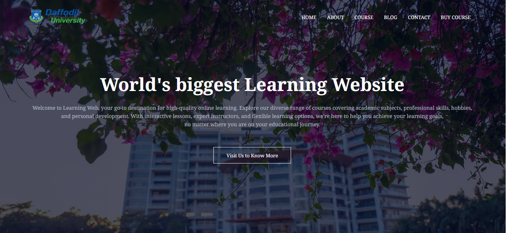

# E-Learning Platform

A simple and interactive learning platform designed for students, offering structured learning modules and a clean user experience.

## 🚀 Live Demo
https://siam-gits.github.io/e-learning

## 📂 Source Code
https://github.com/siam-gits/e-learning

## ✨ Features
- Student-friendly UI  
- Course sections  
- Interactive pages  
- Fully responsive  
- Lightweight and fast  

## 🛠️ Tech Stack
- HTML  
- CSS  
- JavaScript  

---

© All rights reserved to **Siam**
